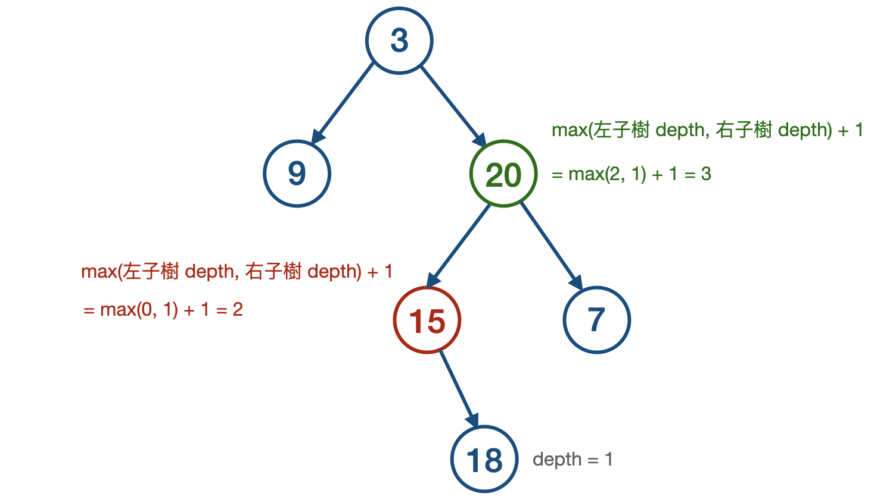

# Maximum Depth of Binary Tree

[題目連結](https://leetcode.com/problems/maximum-depth-of-binary-tree/)

## 題目描述
原文：

Given the `root` of a binary tree, return *its maximum depth*.

A binary tree's **maximum depth** is the number of nodes along the longest path from the root node down to the farthest leaf node.

----

GPT 4 翻譯：

給定一個二元樹的 `root`（根節點），返回*其最大深度*。

二元樹的**最大深度**是從根節點到最遠的葉節點所經過的最長路徑上的節點數量。

----

Example 1


```
Input: root = [3,9,20,null,null,15,7]
Output: 3
```

Example 2

```
Input: root = [1,null,2]
Output: 2
```

Constraints:

* The number of nodes in the tree is in the range `[0, 10^4]`.
* `-100 <= Node.val <= 100`


## 思路



遞迴在遍歷節點時，遍歷到空節點時回傳 `depth = 0`，所以葉子節點就是 `depth = 1`，整體公式如下：  
[Base Case] 遇到空節點時: `return 0`  
[Recursive Case] 其他狀況: `return max(左子樹深度, 右子樹深度) + 1`  

**方法 1: Recursive**

* 步驟
    1. Base Case: `return 0 if root is None`
    2. Recursive Case: `return max(self.maxDepth(root.left), self.maxDepth(root.right)) + 1`
        
* 複雜度
    * 時間複雜度: O(N)
    * 空間複雜度: O(h)   # h 表樹的高度，平均來說為 O(logN)


**方法 2: Iterative**

利用 Iterative 遍歷中，我們需要一個臨時記憶區來保持待處理的節點。這與遞迴方法不同，遞迴是利用呼叫 Stack 來自然地實現深度優先搜索（DFS），而 Iterative 方法則需要額外使用 Stack 或 Queue。 Iterative 方法通常從根節點開始，並逐步向下到達葉子節點，使用一個變數 `max_depth` 來記錄遇到的最大深度。

選擇 Stack 或 Queue 時要注意，不同的記憶區選擇對於不同樣貌的樹會有不一樣的空間複雜度，以這題為例子：  
1. 用 Stack (DFS)：
    * 最佳情況（Best Case）：傾斜樹（Skewed Tree），所有節點只有左子節點或只有右子節點 -> O(1)
    * 一般情況（Average Case）：樹的高度約為 O(h)，對於平衡樹空間複雜度約為 -> O(logN)
    * 最壞情況（Worst Case）：當樹裡面的每個節點只有 0 或 2 個子節點時 -> O(N)

2. 用 Queue (BFS)：
    * 最佳情況（Best Case）：傾斜樹（Skewed Tree），所有節點只有左子節點或只有右子節點 -> O(1)
    * 一般情況（Average Case）：一般狀況約等於樹最後一層的節點數量，空間複雜度約為 -> O(N)
    * 最壞情況（Worst Case）：當樹完全平衡，最大空間需求為最後一層的節點數量，約為 N/2，空間複雜度為 -> O(N)

因為通常樹是往下長的，越接近葉子節點越多，所以用 Stack 會比較有利，Stack 遍歷時會一根樹枝、一根樹枝的去看，看完會「釋放記憶體空間」，有效限制他的增長。

* 步驟
    1. 選一個記憶區，例如選用 stack
    2. 先把根部節點 root 丟入 stack 中
    3. 每一次從 stack 中取一個節點出來
        - 取出來後做 `depth` 的計算
        - 再將左、右子節點與 `depth` 也放入 Stack 中，等待之後被取用。
        
* 複雜度
    * 時間複雜度: O(N)
    * 空間複雜度: O(h)   # h 表樹的高度，平均來說為 O(logN)
