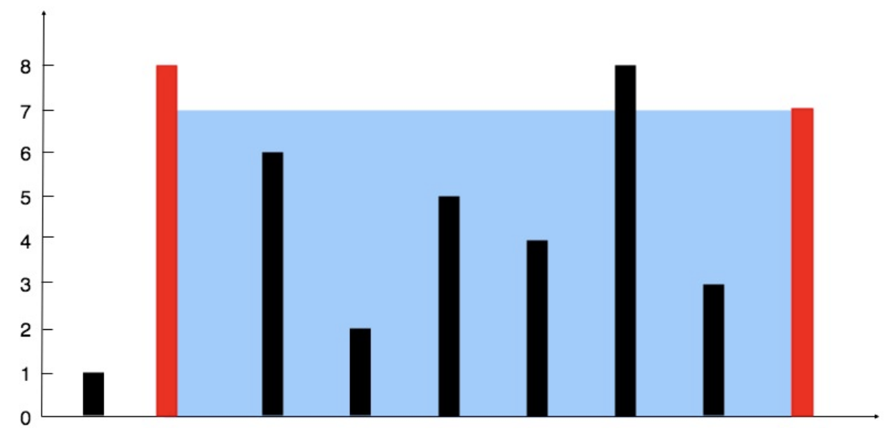
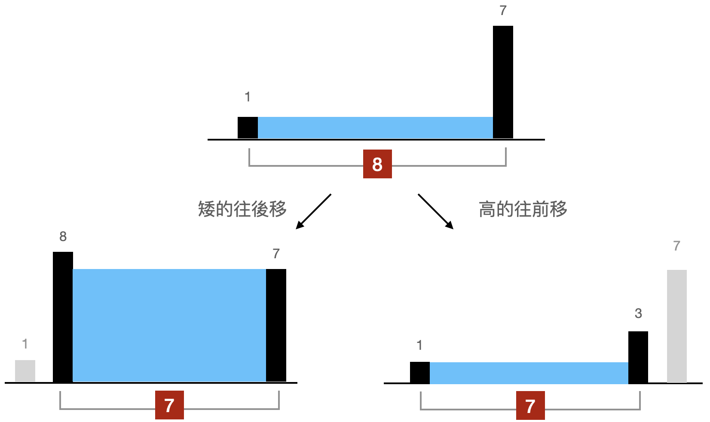

# Container With Most Water
[題目連結](https://leetcode.com/problems/container-with-most-water/)

## 題目描述
原文：

You are given an integer array `height` of length `n`. There are n vertical lines drawn such that the two endpoints of the `ith` line are `(i, 0)` and `(i, height[i])`.

Find two lines that together with the x-axis form a container, such that the container contains the most water.

Return the maximum amount of water a container can store.

Notice that you may not slant the container.

----

GPT 4 翻譯：

給定一個長度為 `n` 的整數陣列 `height`。畫出 `n` 條垂直線，使得第 `i` 條線的兩個端點是 `(i, 0)` 和 `(i, height[i])`。

找出兩條線，與 x 軸一起形成一個容器，使得該容器能夠容納最多的水。

返回一個容器能夠儲存的最大水量。

請注意，容器不能傾斜。

----

Example 1



```
Input: height = [1,8,6,2,5,4,8,3,7]
Output: 49
Explanation: The above vertical lines are represented by array [1,8,6,2,5,4,8,3,7]. In this case, the max area of water (blue section) the container can contain is 49.
```

Example 2
```
Input: height = [1,1]
Output: 1
```

Constraints:

* `n == height.length`
* `2 <= n <= 10^5`
* `0 <= height[i] <= 10^4`

## 思路

這題用暴力解的思維是：用兩個迴圈，去找出所有的 Pair，並計算出所有 Pair 中的最大面積，這樣做需要 O(N^2)，而最少的時間複雜度是，掃過一次之後就知道要挑哪兩根可以獲得最大面積，所以至少是 O(N)。

很多人可能就卡在這裡，我看得出時間複雜度，但要我用 O(N) 的方法做，可以先回到觀察這題本身，觀察題目永遠是想不到怎麼做的時候，應該嘗試的第一步。以這題來說要求最大面積（底 × 高），所以如果要最大就是底最大，高要長。

底最大：表示兩根的距離要盡可能地遠。
高最長：高度會受限於矮的那根，所以盡可能挑兩根最長的。

直觀的做法就是先讓底最遠，所以從左右兩邊各挑一根，看看面積是多少，然後再拔掉一根換另一根試試看，大概圖會長得像下面這樣：



在思考誰要往移動的時候，要用演算法的方式思考，什麼叫做演算法的方式，就是要符合某一個規律和規則運作，可能可以是：

1️⃣ 比較兩根的高或矮，高的移動  
2️⃣ 比較兩根的高或矮，矮的移動  
3️⃣ 比較兩根位置，位置後面的移動  
4️⃣ 比較兩根位置，位置前面的移動  
5️⃣ ...  

各種只要你認為是符合演算法邏輯的條件都可以，但通常只有一個是較正確的做法，以這題為例，2️⃣ 比起其他選項更可行，更可行的意思是，其他的做法，會跳過某些 Pair ，而跳過的這些 Pair 當中包含了最佳解。至於要怎麼知道 2️⃣ 比較好，而不是其他可能，比較笨的做法就是，你每個都做做看，就會知道其他方法的問題在哪裡。

**方法: Two Pointer**

* 步驟
    1. 初始化 left, right 指標
    2. 利用兩指標位置計算面積，若面積較大，就更新最大面積
    3. 「矮的那根」指標要往中間移動。

* 複雜度
    * 時間複雜度: O(N)
    * 空間複雜度: O(1)
