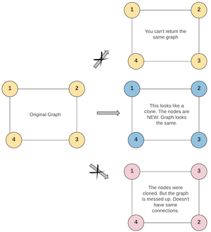

# Clone Graph
[題目連結](https://leetcode.com/problems/clone-graph/description/)

## 題目描述
原文：

Given a reference of a node in a connected undirected graph.

Return a deep copy (clone) of the graph.

Each node in the graph contains a value (`int`) and a list (`List[Node]`) of its neighbors.

```
class Node {
    public int val;
    public List<Node> neighbors;
}
```

**Test case format**:

For simplicity, each node's value is the same as the node's index (1-indexed). For example, the first node with `val == 1`, the second node with `val == 2`, and so on. The graph is represented in the test case using an adjacency list.

**An adjacency list** is a collection of unordered **lists** used to represent a finite graph. Each list describes the set of neighbors of a node in the graph.

The given node will always be the first node with `val = 1`. You must return the **copy of the given node** as a reference to the cloned graph.

----

GPT 4 翻譯：

給定一個節點在一個連通的無向圖中的引用。

返回該圖的一個深拷貝（克隆）。

圖中的每個節點包含一個值（`int`）和一個其鄰居的列表（`List[Node]`）。

```java
class Node {
    public int val;
    public List<Node> neighbors;
}
```

**測試案例格式**：

為了簡化，每個節點的值與節點的索引相同（1為起始索引）。例如，第一個節點的 `val == 1`，第二個節點的 `val == 2`，依此類推。在測試案例中使用鄰接表來表示圖。

**一個鄰接表**是用來表示有限圖的一系列無序的**列表**。每個列表描述了圖中一個節點的鄰居集合。

給定的節點將始終是 `val = 1` 的第一個節點。你必須返回**給定節點的副本**作為克隆圖的引用。

----

Example 1


```
Input: adjList = [[2,4],[1,3],[2,4],[1,3]]
Output: [[2,4],[1,3],[2,4],[1,3]]
Explanation: There are 4 nodes in the graph.
1st node (val = 1)'s neighbors are 2nd node (val = 2) and 4th node (val = 4).
2nd node (val = 2)'s neighbors are 1st node (val = 1) and 3rd node (val = 3).
3rd node (val = 3)'s neighbors are 2nd node (val = 2) and 4th node (val = 4).
4th node (val = 4)'s neighbors are 1st node (val = 1) and 3rd node (val = 3).

```

Example 2

```
Input: adjList = [[]]
Output: [[]]
Explanation: Note that the input contains one empty list. The graph consists of only one node with val = 1 and it does not have any neighbors.
```
Example 3
```
Input: adjList = []
Output: []
Explanation: This an empty graph, it does not have any nodes.
```

Constraints:

* The number of nodes in the graph is in the range `[0, 100]`.
* `1 <= Node.val <= 100`
* `Node.val` is unique for each node.
* There are no repeated edges and no self-loops in the graph.
* The Graph is connected and all nodes can be visited starting from the given node.

## 思路

以範例用演算法思維在想的時候，知道說如果我們先從節點 1 開始走，那麼會知道他有連接節點 2 和節點 4，如果你先做完 Trie 的題型，就會知道說，可以把連接的所有節點都放到 children 裏面，而在無向圖中我們會叫做 neighbors ，因為他們並無父子關係。所以現在狀況是：  
`visited: { 1 }`, `1.neighbors = { 2, 4 }` 這時後再去遞迴 neighbors 看他們連接誰。  
`visited: { 1, 2 }`, `2.neighbors = { 1, 3 }` 再遇去做節點 `4`。  
`visited: { 1, 2, 4 }`, `4.neighbors = { 1, 3 }` 做到這邊手要抖一下。  

為何手要抖一下呢？因為 `2` 也有一個鄰居 `3`、`4` 也有一個鄰居 `3`，這兩個節點 `3` 是不是同一個呢？他們要是同一個對吧？但我演算法在跑的時候，怎麼知道他是不是同一個？  

這時候可以反過來思考，如果多什麼樣的條件，可以確保他們一定指向同一個？有的，**`Node.val` is unique for each node.** 這句話就是確保讓你知道，數字唯一，所以如果看到兩個節點有同樣數值的鄰居，那代表這個鄰居是同一個人。


**方法 A：BFS**

利用 Queue 來協助 BFS 的進行、以及利用 Hashmap 來將拜訪過的節點存起來。

**步驟**
  1. 初始化: 創建一個 Hashmap 來存原始圖中的節點和它們的複製。這將幫助我們在複製過程中保持節點的對應關係。
  2. 創建第一個節點的複製: 將給定的節點（val = 1）複製到新圖中，並將原始節點和複製節點存儲在 Hashmap 中。
  3. 使用 BFS 遍歷圖: 使用一個隊列來進行廣度優先搜索。首先，將給定的節點（val = 1）加入 Queue。
  4. 遍歷 Queue:
     1. 從 Queue 中取出一個節點。
     2. 檢查此節點的所有鄰居。對於每個鄰居，如果它還沒有被複製（即不在 Hashmap 中），則創建它的複製並將其添加到 Hashmap 中，然後將它加入 Queue 中以後續進行遍歷。
     3. 更新當前節點複製的鄰居列表，使其包含所有鄰居的複製。
  5. 重複步驟 4，直到 Queue 為空，這表示所有節點都已被訪問和複製。

**複雜度**
  * 時間複雜度：O(N + M)
  * 空間複雜度：O(N)
  * 備註：N 為節點數量、M 為邊數


---

**方法 B: DFS**

利用 Recursive 的進行、以及利用 Hashmap 來將拜訪過的節點存起來。

**步驟**

  1. 定義遞迴函數：
     * 創建一個函數 cloneGraph(Node node) 來遞迴地複製圖。
     * 創建一個哈希表 HashMap<Node, Node> 用於記錄原始節點與其複製節點的對應關係，這樣可以避免重複複製同一節點並幫助快速訪問複製節點。
  2. 檢查空節點 (Base Case)：
     * 如果傳入的節點為 None，則返回 None。
  3. 檢查節點是否已被複製：
     1. 如果這個節點已經在 Hashmap 中，意味著已經複製過了，直接從 Hashmap 中返回該節點的複製。
  4. 複製節點：
     * 創建一個新節點，其值與傳入的節點值相同。
     * 將原始節點及其複製放入 Hashmap 中。
  5. 複製鄰居節點：
     * 遍歷原始節點的每個鄰居節點，對於每個鄰居節點，遞迴調用 cloneGraph 函數並將結果加入到複製節點的鄰居列表中。
  6. 返回複製的節點：
     * 最後返回新複製的節點。


**複雜度**
  * 時間複雜度：O(N + M)
  * 空間複雜度：O(N)
  * 備註：N 為節點數量、M 為邊數
