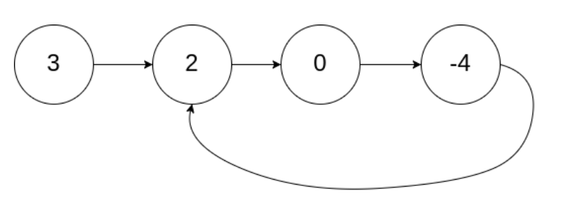
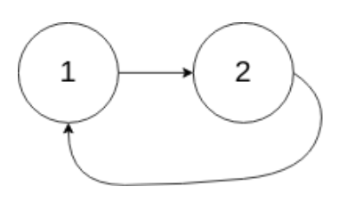
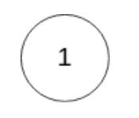

# Linked List Cycle

[題目連結](https://leetcode.com/problems/linked-list-cycle/)

## 題目描述
原文：

Given `head`, the head of a linked list, determine if the linked list has a cycle in it.

There is a cycle in a linked list if there is some node in the list that can be reached again by continuously following the `next` pointer. Internally, `pos` is used to denote the index of the node that tail's `next` pointer is connected to. **Note that** `pos` **is not passed as a parameter.**

Return `true` *if there is a cycle in the linked list*. Otherwise, return `false`.

 

----

GPT 4 翻譯：

給定 `head`，即鏈表的頭節點，判斷鏈表中是否有循環。

如果鏈表中存在某個節點，通過不斷跟隨 `next` 指針可以再次到達該節點，則該鏈表存在循環。在內部，`pos` 被用來表示尾節點的 `next` 指針所連接的節點的索引。**注意，**`pos` **不作為參數傳遞。**

如果鏈表中存在循環，則返回 `true`。否則，返回 `false`。

----

Example 1



```
Input: head = [3,2,0,-4], pos = 1
Output: true
Explanation: There is a cycle in the linked list, where the tail connects to the 1st node (0-indexed).
```

Example 2



```
Input: head = [1,2], pos = 0
Output: true
Explanation: There is a cycle in the linked list, where the tail connects to the 0th node.
```

Example 3



```
Input: head = [1], pos = -1
Output: false
Explanation: There is no cycle in the linked list.
```

Constraints:

* The number of the nodes in the list is in the range `[0, 10^4]`.
* `-10^5 <= Node.val <= 10^5`
* `pos` is `-1` or a **valid index** in the linked-list.

## 思路

以人類的思考方式：如何判斷重複？那就把有走過的紀錄起來，然後每才都去判斷這個節點是不是走過了。這樣做可以嗎？可以！  

但問題來了，判斷過去有沒有存在過，感覺可以用 Set 來當我們的記憶區，但是 Set 能夠放一個 ListNode 進去嗎？答案是可以！  

可以放不可變（immutable）的資料類型  
1. 數字類型：例如整數（int）、浮點數（float）和複數（complex）。
2. 字符串（string）。
3. 元組（tuple），但前提是元組包含的元素也必須是不可變的。  

不可以放入可變（mutable）的資料類型
1. 列表（list）。
2. 字典（dict）。
3. 集合（set）本身也是可變的，因此不能包含在另一個集合中。

那 class 可不可以呢？是可以的，因為 class 在創建實例時，會利用其記憶體位置做 hash，會是獨一無二的值。  

---

**方法 A: Iterative + Set**

* 步驟
    1. 遍歷所有節點，將遍歷的節點放入 Set 中。
    2. 如果遍歷的節點存在於 Set 中，那就代表有 Cycle。

* 複雜度
    * 時間複雜度: O(N)
    * 空間複雜度: O(N)

---

時間複雜度應該是沒辦法再變更低了，因為一定要遍歷一遍，但空間複雜度有沒有辦法再往下降？也就是不用任何一個記憶區，就能做完。我們可以嘗試看看：  

你知道的有哪些演算法，可以不用耗費任何空間複雜度做到呢？  
可能可以的：  
✅ BFS/DFS  
✅ Binary Search  
✅ Two Pointer  
✅ Sliding Window  

一定不行的：  
❌ Dynamic Programming  
❌ Hashing  

根本題無關的：  
❌ Bit manipulation: 跟數字無關。  
❌ Greedy Approach: 並非找最優解或路徑。  
❌ Divide and Conquer: 無法拆分，且問題非獨立。  

---

每一個都來試試看：  
❌ BFS/DFS: 只有一條路徑，就是單純用 Loop 做 Traversal，我們方法 A 嘗試過了。要判斷重複需要有記憶區協助。  
❌ Binary Search: Linked List 要實作 Binary Search 若不用記憶區，可能會讓時間複雜度大量提升。  
💡 Two Pointer:   
　❌ 左右型：Linked List 的特性，右指標沒辦法往前移動。  
　💡 快慢型：快地指標往前跑和慢的指標往前跑，有沒有機會撞到，撞到就代表有 cycle 了。  
❌ Sliding Window: 通常應用在陣列，不適合用在 Linked List 中。  

就只剩一種可能了，就這麼剛好是他嗎？對的！而且這個方法叫做：Floyd's Cycle Finding Algorithm。他是怎麼做的呢？  
 
在腦中想像一下，如果今天有兩位跑者在操場的跑道上跑步，如果這個跑道是一個 cycle，開跑後，那跑得快的跑者一定會和慢的跑者只要不是等速前進，一定會再碰到。  

**所以一個快指標每一次走兩步、慢指標每次走一步，有一天他們會停留在同一個指標。**


**方法 2: Two Pointers**

* 步驟
    1. 初始化 slow 和 fast 指標。  
    2. 判斷 fast 指標是否等於 slow 節點，是的話返回 True。

* 複雜度
    * 時間複雜度: O(N)
    * 空間複雜度: O(1)

* 延伸討論
    * 有沒有可能即使有 cycle 但永遠無法停留在同一節點？
        * 不會，因為快指標走偶數格、慢指標走奇數格所以在有限步數內一定會撞到。
