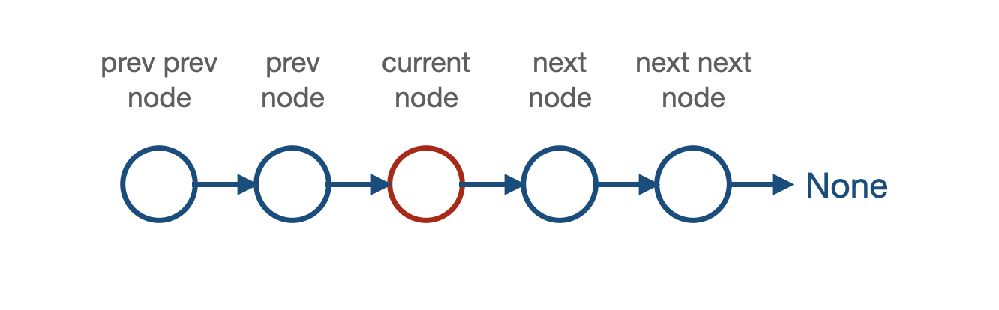
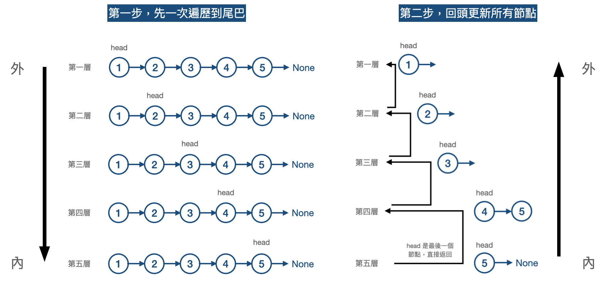

# Reverse Linked List

[題目連結](https://leetcode.com/problems/reverse-linked-list/)

## 題目描述
原文：

Given the `head` of a singly linked list, reverse the list, and return the reversed list.

----

GPT 4 翻譯：

給定單向鏈表的 `head`，反轉該鏈表，並返回反轉後的鏈表。

----

Example 1


```
Input: head = [1,2,3,4,5]
Output: [5,4,3,2,1]
```

Example 2


```
Input: head = [1,2]
Output: [2,1]
```

Example 3

```
Input: head = []
Output: []
```

Constraints:

* The number of nodes in the list is the range `[0, 5000]`.
* `-5000 <= Node.val <= 5000`


## 前情提要

開始進入 Linked List 的環節，應該有許多人一開始寫程式時，就知道有陣列可以使用，但比較少人會直接用 Linked List 來寫，所以對 Linked List 非常的不熟悉，這邊我們需要先來介紹一下陣列和 Linked List 的差別。

1️⃣ 動態記憶體分配：與陣列不同，Linked List 的節點通常是動態分配的。在一個陣列中，當它被創建時，需要一個連續的記憶體區塊。相對地，Linked List 的每個新節點可以在記憶體的任何可用位置被分配，因為節點之間的連接是通過指針實現的，而不是物理上的相鄰。

2️⃣ 指針與節點結構：每個 Linked List 的節點通常包含兩部分：一部分是數據（儲存元素的值），另一部分是指針（存儲指向下一個節點的記憶體地址）。這些指針是 Linked List 結構的核心，它們將散落在記憶體中的節點串聯起來。

3️⃣ 非連續記憶體分佈：由於每個節點都是分別分配的，Linked List 中的節點在記憶體中不需要是連續的。這與陣列形成對比，陣列要求記憶體連續，這使得 Linked List 更加靈活，特別是在有限記憶體空間的情況下。

4️⃣ 記憶體利用率與碎片化：Linked List 的這種分配方式可能導致記憶體碎片化，尤其是在頻繁的插入和刪除操作中。雖然單個節點的分配與釋放相對容易，但這種不連續的記憶體使用方式可能不如陣列那樣高效。

5️⃣ 時間與空間考量：在時間效率方面，Linked List 的插入和刪除操作通常比陣列快，因為它們不需要移動其他元素。然而，在空間效率方面，由於每個節點都需要額外的空間來存儲指針，Linked List 的空間利用率可能不如陣列高。

## 本題思路



如果要做到反轉，需要有幾個指標才能做到，我們先以上圖為範例，分別是 `prev_prev_node`、`prev_node`、`current_node`、`next_node`、`next_next_node`？  
1️⃣ 如果只有 1 個指標 (`current_node`)：  
```python
current_node.next = (current_node 的前一個節點)  # ❌ 單向 Linked List 特性在於，只能得知下一個指標位置，無法得知前一個指標位置，所以不可行。
```

2️⃣ 如果有 2 個指標 (`prev_node`, `current_node`)：  
```python
current_node.next = prev_node     # 反轉。
prev_node = current_node          # 移動 prev 到 current 的位置。
current_node = ??                 # ❌ next 往 prev 指向之後，就找不到原本的 next 了。
```

3️⃣ 如果有 3 個指標 (`prev_node`, `current_node`, `next_node`)：  
```python
current_node.next = prev_node     # 反轉。
prev_node = current_node          # 移動 prev 到 current 的位置。
current_node = next_node          # 移動 current 到 next_node 的位置。
next_node = next_node.next        # 這邊示意 next_node 往後移動一格 -> 但通常移動到上方第一行 next_node = current_node.next 避免 next_node 是 None 的時候會報錯（可參考程式碼 approach1.py）。
```

到底要幾個指標的問題，通常都是因為節點的 next 再重新定向的時候，導致原本的 next_node 就失去鏈結，然後就永遠找不到了，所以都需要先用一個指標指著他。  

所以以這題來看，應該會是三個指標是最直觀，最容易寫的，當然也可以嘗試縮減到兩個來解決，但只有一個的話應該是沒辦法。

**方法 1: Iterative**

* 步驟
    1. 初始化指標
    2. 遍歷所有節點，並轉換指標，轉換方法如上。

* 複雜度
    * 時間複雜度: O(N)
    * 空間複雜度: O(1)

**方法 2: Recursive**

用遞迴的方式就會比較難想，但他的作法在於：「不要邊走邊轉換指標，而是先一路走到底，再回過頭來慢慢更新」！  
假設現在有一個單項鏈結串列為 1 -> 2 -> 3 -> 4 -> 5  
則需要先讓遞迴走到底走的過程如下：  



可以看最後兩個步驟，難的地方在於，第五層回來的節點，如何跟第四層的節點 head 結合再一起並反轉，如下：  
```python
return_node = self.recursive(head.next)
head.next.next = head    # 讓 5 指向 4
head.next = None         # 讓 4 指向 None
```

注意：以第四層返回第三層為例，因為節點 3 一直都接著節點 4（也就是說 3 和 5 的下一個都接著 4），所以不會有斷鏈的問題。

* 複雜度
    * 時間複雜度: O(N)
    * 空間複雜度: O(1)
