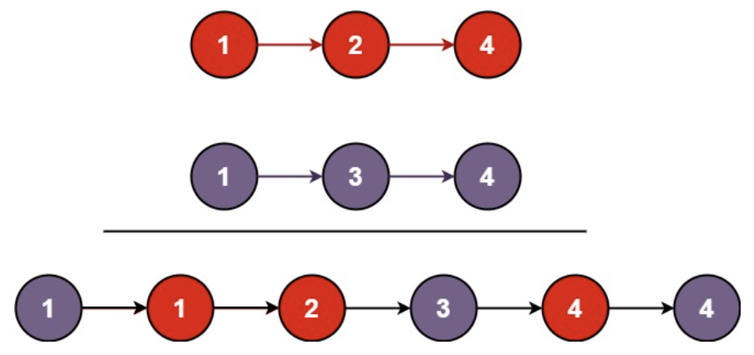

# Reverse Linked List

[題目連結](https://leetcode.com/problems/merge-two-sorted-lists/)

## 題目描述
原文：

You are given the heads of two sorted linked lists `list1` and `list2`.

Merge the two lists into one **sorted** list. The list should be made by splicing together the nodes of the first two lists.

Return *the head of the merged linked list*.


----

GPT 4 翻譯：

給定兩個已排序的鏈結串列 `list1` 和 `list2` 的頭節點。

將這兩個串列合併成一個**排序後**的串列。這個串列應該通過拼接前兩個串列的節點來製作。

返回*合併後鏈結串列的頭節點*。

----

Example 1



```
Input: list1 = [1,2,4], list2 = [1,3,4]
Output: [1,1,2,3,4,4]
```

Example 2

```
Input: list1 = [], list2 = []
Output: []
```

Example 3

```
Input: list1 = [], list2 = [0]
Output: [0]
```

Constraints:

* The number of nodes in both lists is in the range `[0, 50]`.
* `-100 <= Node.val <= 100`
* Both `list1` and `list2` are sorted in **non-decreasing** order.


## 思路

思路 1: 先將 list2 串在 list1 後面，在想辦法做排序演算法。  
⚠️ 可行：但是實作困難，且時間複雜度至少為 O((N+M)log(N+M))。    

思路 2: 把 list1 和 list2 的值都取出來存到陣列中，在針對陣列做排序。  
⚠️ 可行，實作簡單，但時間複雜度至少為 O((N+M)log(N+M))。  

思路 3: 觀察一下題目，合併有序陣列的狀況，其實不需要真的做排序，而是去比較他們的頭部節點，就可以知道誰比較小，然後取小的那一個節點。  
✅ 可行，而且時間複雜度只需要 O(N+M)，空間複雜度是 O(1)。  

**方法 1: Recursive**

先找到他的 Recursive 的函示，意味著「能不能找到一個規律，可以讓他一直做一樣的事情」，以這題來說，合併兩個有序鏈表 `l1`, `l2` 就等於  
狀況一：若當前 `l1` 目前比 `l2` 小的時候 `l1 + merge(l1.next, l2)`  
狀況二：其他狀況則 `l2 + merge(l1, l2.next)`  
狀況三：`l1` 或 `l2` 任一為空時，回傳另一個鏈表的頭部。  

* 步驟
    1. base case:  
        - 若 `l1` 是 `None` 則返回 `l2`
        - 若 `l2` 是 `None` 則返回 `l1`
    2. recursive case:
        - 若 `l1 < l2`: 返回 `merge(l1.next, l2)`。
        - 若 `l2 <= l1`: 返回 `merge(l1, l2.next)`。

* 複雜度
    * 時間複雜度: O(N + M)
    * 空間複雜度: O(N + M)

**方法 2: Iterative**

先設定一個 Dummy Head，其目的是要儲存結果，再來兩個鏈表都掃過一次，在掃的時候兩個節點互相比較，值比較小的節點可以拉出來放到 Dummy Head 的後面。

* 步驟
    1. 初始化指標 `curr = dummy = ListNode()`
    2. 做以下步驟：
        - `l1` 和 `l2` 誰比較小，小的就放到 `curr.next`。
        - 移動指標，已加入 `curr` 的指標需往後移動一格，`curr` 自己也需要往後一格。
    3. 最後將沒有放入的節點通通放入 `curr.next`。

* 複雜度
    * 時間複雜度: O(N + M)
    * 空間複雜度: O(1)
