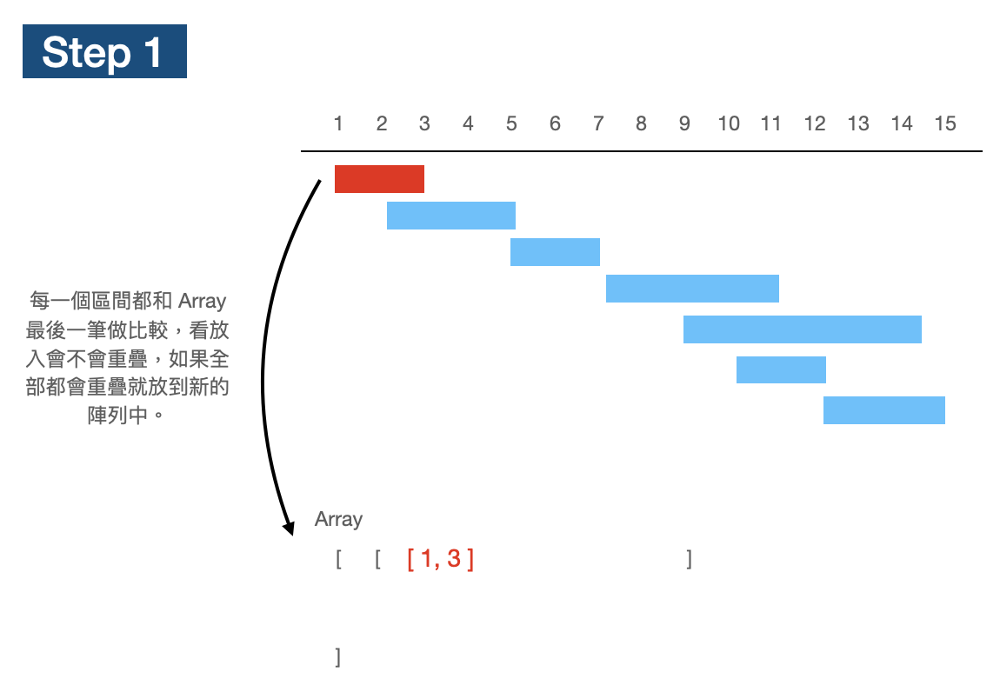
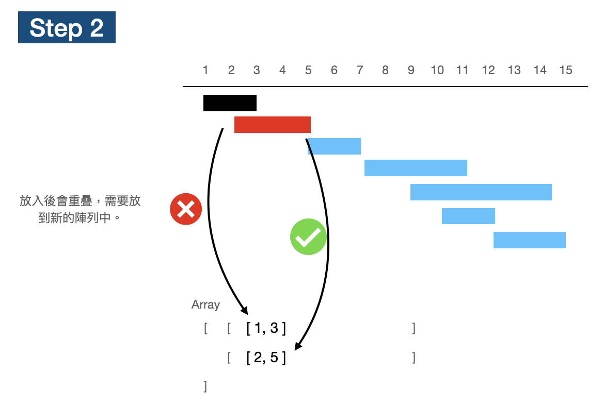

# Meeting Rooms II

[題目連結](https://leetcode.com/problems/meeting-rooms-ii/)

## 題目描述
原文：
  
Given an array of meeting time intervals `intervals` where `intervals[i] = [start_i, end_i]`, return *the minimum number of conference rooms required.*

----

GPT 4 翻譯：

給定一個會議時間間隔的陣列 `intervals`，其中 `intervals[i] = [start_i, end_i]`，返回*所需的最小會議室數量*。

----

Example 1
```
Input: intervals = [[0,30],[5,10],[15,20]]
Output: 2
```

Example 2
```
Input: intervals = [[7,10],[2,4]]
Output: 1
```

Constraints:
* `1 <= intervals.length <= 10^4`
* `0 <= start_i < end_i <= 10^6`


## 思路：

這題如果直觀來想，可能會想要這樣做：





這樣做有什麼大問題，你有發現嗎？那就是如果每一次都是從陣列的頭往前掃，所以需要 O(N) 的時間，如果每一個區間都要這樣做，最糟可能需要 O(N^2) 的時間複雜度（e.g. N 個區間全都重疊時），那該怎麼快速找到可以插入的陣列呢？

利用 min Heap 來協助處理，min Heap 每一次將最早釋出會議室的區間找出來，如果連這間會議室都排不進去的話，其他就不用比了，一定也排不進去。

複雜度：
- 時間複雜度：O(NlogN) 
- 空間複雜度：O(N)
