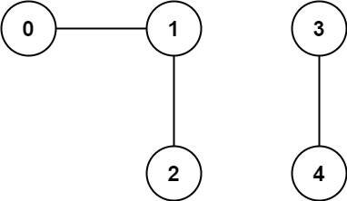

# Number of Connected Components in an Undirected Graph

[題目連結](https://leetcode.com/problems/number-of-connected-components-in-an-undirected-graph/description/)

## 題目描述
原文：

You have a graph of `n` nodes. You are given an integer n and an array `edges` where `edges[i] = [ai, bi]` indicates that there is an edge between `ai` and `bi` in the graph.

Return *the number of connected components in the graph.*

----

GPT 4 翻譯：

你有一個包含 `n` 個節點的圖。你將得到一個整數 `n` 和一個數組 `edges`，其中 `edges[i] = [ai, bi]` 表示圖中 `ai` 和 `bi` 之間存在一條邊。

返回*該圖中連通分量的數量。*

----

Example 1



```
Input: n = 5, edges = [[0,1],[1,2],[3,4]]
Output: 2
```

Example 2


```
Input: n = 5, edges = [[0,1],[1,2],[2,3],[3,4]]
Output: 1
```


Constraints:

* `1 <= n <= 2000`
* `1 <= edges.length <= 5000`
* `edges[i].length == 2`
* `0 <= ai <= bi < n`
* `ai != bi`
* There are no repeated edges.


## 思路

這題就如同 [200. Number of Islands](https://leetcode.com/problems/number-of-islands/) 類似，而這題是 Graph 版的，所以用同樣的思維來看這題，也就是說，先把 Graph 建立好後，再從一個節點去做 DFS，DFS 的過程中就把經過的節點設為「已拜訪過」，下一次再從還沒拜訪過的節點中再去做 DFS，直到結束。有沒有跟 200 題很像呢？


**方法 1: DFS**

* 步驟
  * 初始化變量：
    * 檢查如果節點數 n 為 0，則直接返回 0，因為沒有連通分量。
    * 初始化 components 為 0，用於記錄連通分量的數量。
    * 創建一個長度為 `n` 的 visited 列表，用於跟蹤每個節點是否被訪問過。初始情況下，所有節點都設置為 0（未訪問）。
    * 建立一個圖的鄰接列表 graph，用於存儲每個節點的鄰居節點。
  * 建立圖：
    * 遍歷 edges 列表中的每條邊，將每條邊的兩個節點互相加入對方的鄰接列表。這樣就建立了無向圖的表示。
  * 定義深度優先搜索（DFS）：
    * 實現一個 dfs 函數，用於從一個節點開始深度優先搜索。
    * 在 dfs 函數中，首先將當前節點標記為已訪問。
    * 然後遍歷當前節點的所有鄰居節點，如果某個鄰居未被訪問，則對該鄰居執行 dfs。
  * 計算連通分量：
    * 遍歷每個節點，對於每個未訪問的節點，調用 dfs 函數進行搜索。
    * 每當從一個未訪問的節點開始 dfs，意味著找到了一個新的連通分量，因此將 components 變量加 1。
  * 返回結果：
    * 在遍歷完所有節點後，返回 components 的值，這就是圖中連通分量的總數。

* 複雜度
  * 時間複雜度: O(E + V)
  * 空間複雜度: O(E + V)
  * E 為邊的數量，V 為節點數量。


**方法 2: Union-Find**

這題也很適合使用 Union-Find 的做法，其核心在於兩個基本操作：find 和 union。這兩個操作共同實現了一種高效的集合管理方法，尤其適用於處理動態集合的合併和查詢問題。以下是這兩個操作的核心要素：  

1. Find（查找）：
   * 目的：查找給定元素所在集合的代表元素（通常是集合的「根節點」）。
   * 實現：透過追蹤每個元素的「父節點」連結，最終達到根節點。根節點是其自身的父節點。
   * 優化：路徑壓縮技術可以在進行查找操作的過程中將所有經過的節點直接連接到根節點，從而減少未來查找操作的路徑長度。
   * 複雜度：
     * 時間複雜度：
       * 在未使用路徑壓縮的情況下，最壞情況的時間複雜度可以達到 O(n)，其中 n 是節點數量。這是因為在極端情況下，樹可能變成一個長鏈。
       * 使用路徑壓縮後，find 操作的平均時間複雜度會顯著降低，接近 O(1)。實際上，在使用路徑壓縮的情況下，find 操作的時間複雜度可以被認為是攤銷常數時間（Amortized Constant Time）。
     * 空間複雜度：
       * Find 操作本身不需要額外的空間，因此其空間複雜度為 O(1)。

2. Union（合併）：
   * 目的：合併兩個元素所屬的集合。
   * 實現：先使用 find 操作找到兩個元素所屬集合的根節點，然後將其中一個集合的根節點連接到另一個集合的根節點。
   * 優化：按秩（或按大小）合併技術可以將較小或較低秩的集合連接到較大或較高秩的集合，從而保持樹的高度較低，避免形成過高的樹結構。
   * 複雜度：
     * 時間複雜度：
       * Union 操作涉及兩次 find 操作來確定兩個元素的根節點。因此，它的時間複雜度主要取決於 find 操作的時間複雜度。在使用路徑壓縮和按秩合併的情況下，union 操作的平均時間複雜度也接近 O(1)。
     * 空間複雜度：
       * Union 操作本身不需要額外的空間，因此其空間複雜度也是 O(1)。


* 步驟
   1. 初始化: 
      1. parents: 存放每一個節點的父節點。
      2. rank: 存每個節點的秩 (通常表示樹的高度)
      3. components: 連通分量的數量
   2. 定義 Find 函數
      1. 這個函數用來找出給定節點的根節點（代表元素）。如果節點的父節點是它自己，則返回該節點。否則，遞迴地尋找父節點的根節點，並進行路徑壓縮。
   3. 定義 Combine 函數
      1. 這個函數用於合併兩個節點所屬的集合。
      2. 使用 find 函數找到兩個節點的根節點。
      3. 如果兩個根節點相同，則它們已在同一集合中，不進行合併。
      4. 如果根節點不同，則根據它們的秩來決定如何合併（較低秩的根節點指向較高秩的根節點）。如果秩相同，則選擇一個作為新的根，並增加其秩。
   4. 遍歷所有邊
      1. 對於每條邊，嘗試使用 combine 函數合併兩個節點。
      2. 如果一條邊導致兩個節點合併（即它們原本不在同一集合中），則連通分量的數量減少。

* 複雜度
  * 時間複雜度: O(E + V)
  * 空間複雜度: O(V)
  * E 為邊的數量，V 為節點數量。
