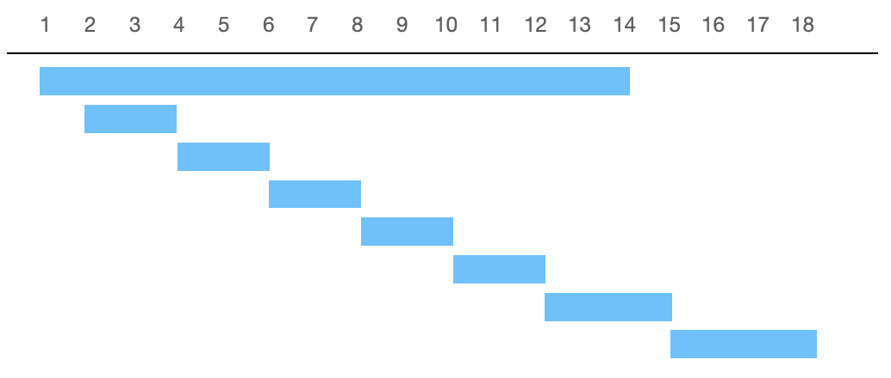
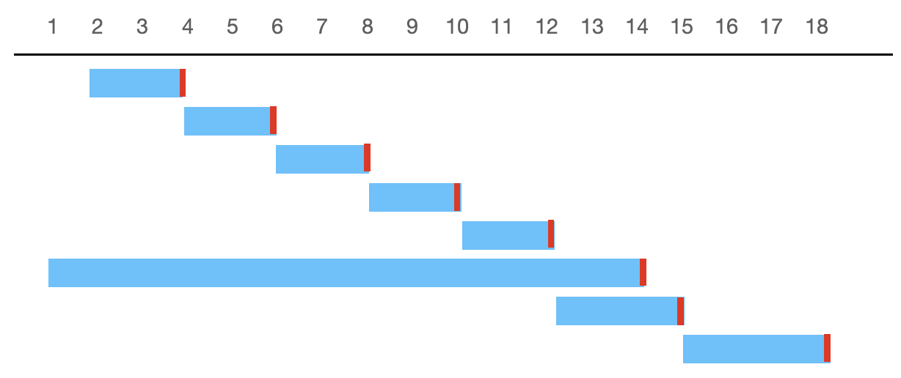

# Non-overlapping Intervals

[題目連結](https://leetcode.com/problems/non-overlapping-intervals/description/)

## 題目描述
原文：
  
Given an array of intervals `intervals` where `intervals[i] = [start_i, end_i]`, return *the minimum number of intervals you need to remove to make the rest of the intervals non-overlapping.*

----

GPT 4 翻譯：

給定一個區間數組 `intervals`，其中 `intervals[i] = [start_i, end_i]`，返回*你需要移除的最小區間數量，使得剩餘的區間互不重疊。*

----

Example 1
```
Input: intervals = [[1,2],[2,3],[3,4],[1,3]]
Output: 1
Explanation: [1,3] can be removed and the rest of the intervals are non-overlapping.
```

Example 2
```
Input: intervals = [[1,2],[1,2],[1,2]]
Output: 2
Explanation: You need to remove two [1,2] to make the rest of the intervals non-overlapping.
```

Example 3
```
Input: intervals = [[1,2],[2,3]]
Output: 0
Explanation: You don't need to remove any of the intervals since they're already non-overlapping.
```

Constraints:
* `1 <= intervals.length <= 10^5`
* `intervals[i].length == 2`
* `-5 * 10^4 <= start_i < end_i <= 5 * 10^4`


## 思路：

這題和 56 題、57 題相比，多了一個條件，就是移除最少的區間，達到他們彼此之間是沒有重疊的，因此我們看一下下面的例子，我們先假設用第 56 題一樣的做法，將區間針對 x 軸做排序：


從上圖可以知道，要刪除最少的話，那就是把第一個區間 `[1,14]` 拿掉，如果這樣想的話，就落入一個人類視角的陷阱，因為迴圈在跑第一個區間的時候，並不知道他後面是否有重疊。要怎麼讓 `[1,14]` 可以順利被拿掉呢？答案是：換個方排序方式，如下圖：



當我們利用 y 軸來進行排序時，就可以把 `[1, 14]` 挑出來，如果不安心的同學，建議可以多嘗試幾種區間，看是不是如此唷！

複雜度：
- 時間複雜度：O(NlogN) 
- 空間複雜度：O(logN)
