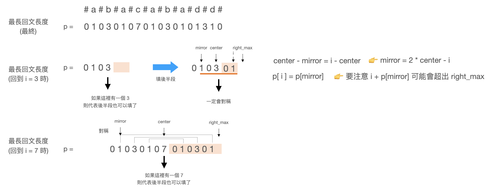

# Longest Palindromic Substring

[題目連結](https://leetcode.com/problems/longest-palindromic-substring/description/)

## 題目描述
原文：
  
Given a string `s`, return the longest palindromic substring in `s`.

----

GPT 4 翻譯：

給定一個字符串 `s`，返回 `s` 中最長的回文子串。

----

Example 1
```
Input: s = "babad"
Output: "bab"
Explanation: "aba" is also a valid answer.
```

Example 2
```
Input: s = "cbbd"
Output: "bb"
```

Constraints:
* `1 <= s.length <= 1000`  
* `s` consist of only digits and English letters.  


## 思路：

這題的暴力解，就是找出所有的子字串，然後判斷每一個子字串是不是回文，最後找出最長的。這樣的過程中一定會有很多不必要的子字串被找出來，浪費了不少時間，因此我們可以換個方式來想。  

判斷子字串是不是回文，可以回到回文的特性來看，回文就是要從一個字母往外找看是否存在，例如：
`abcba` -> 可以從 `c` 往外擴，去看前後是否一致。  
當然也有偶數得狀況如下：
`acca` -> 從 `cc` 往外擴，去看前後是否一致。  

所以第一種解法，就是枚舉的掃一遍，如同方法 A。


## 方法 A: 枚舉法

先分成奇數和偶數兩種情形，然後分別掃過每一個數字。

```python
# expand 函數，就是從中心往外找最長的回文。
def expand(left, right):
    while valid(left) and valid(right) and s[left] == s[right]:
        left -= 1
        right += 1
    return right - left + 1


for i in range(len(s)):
    odd_length = expand(i, i)    # 奇數
    even_legnth = expand(i, i + 1)   # 偶數
    ...

```

* 複雜度：
  * 時間複雜度：O(N^2)
  * 空間複雜度：O(1)


## 方法 B: Manacher's Algorithm

方法 A 有哪些問題？  
1. 奇數和偶數要分開做很麻煩，而且容易錯
2. 每一次都需要重新算，導致速度慢。

因此有一個演算法叫做 Manacher's Algorithm ，他可以用來快速的找到回文的演算法。可以做的第一件事情是，解決 1 的問題。  
重新改造一下輸入，用 `#` 穿插在字母之間：  
1. `abba` （偶數）-> `#a#b#b#a#` （奇數）
2. `abcba` （奇數）-> `#a#b#c#b#a#` （奇數）

Manacher's Algorithm 解決速度慢的問題，以這題為例：`s = "abacabadd"`  
如果以 `c` 為中心知道 `abacaba` 是他的最長回文時，下一次就直接跳到 `d` 去做，不用再從 `c` 的下一個去做，可以加快時間。



* 複雜度：
  * 時間複雜度：O(N)
  * 空間複雜度：O(N)