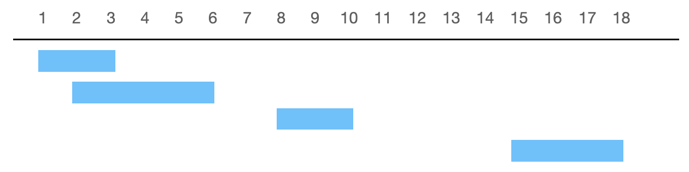

# Merge Intervals

[題目連結](https://leetcode.com/problems/merge-intervals/description/)

## 題目描述
原文：
  
Given an array of `intervals` where `intervals[i] = [start_i, end_i]`, merge all overlapping intervals, and return *an array of the non-overlapping intervals that cover all the intervals in the input.*
 

----

GPT 4 翻譯：

給定一個區間陣列 `intervals`，其中 `intervals[i] = [start_i, end_i]`，合併所有重疊的區間，並返回*一個涵蓋輸入中所有區間的非重疊區間陣列*。

----

Example 1
```
Input: intervals = [[1,3],[2,6],[8,10],[15,18]]
Output: [[1,6],[8,10],[15,18]]
Explanation: Since intervals [1,3] and [2,6] overlap, merge them into [1,6].
```

Example 2
```
Input: intervals = [[1,4],[4,5]]
Output: [[1,5]]
Explanation: Intervals [1,4] and [4,5] are considered overlapping.
```


Constraints:
* `1 <= intervals.length <= 10^4`
* `intervals[i].length == 2`
* `0 <= start_i <= end_i <= 10^4`


## 思路：

如果是第一次做到這類型的題目，建議就可以畫一張圖，就可以更容易懂，以範例一為例，畫完圖會變成：


可以發現，要怎麼發現重疊呢？那就是排序過後每兩兩比較，如果`第二個區間的開始 < 第一個區間的結束` 那就代表重疊了，重疊後新的區間為：`[第一個區間的開始, max(第一個區間的結束, 第二個區間的結束)]`，

複雜度：
- 時間複雜度：O(NlogN) # 因為需要先用快速排序
- 空間複雜度：O(logN) # 快速排序所需要的空間
