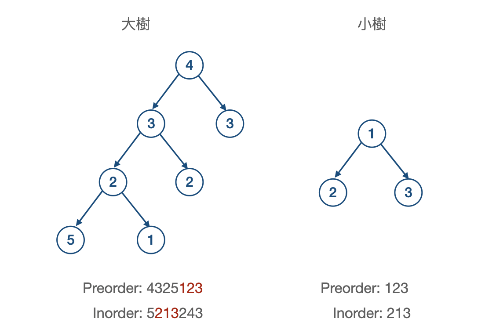
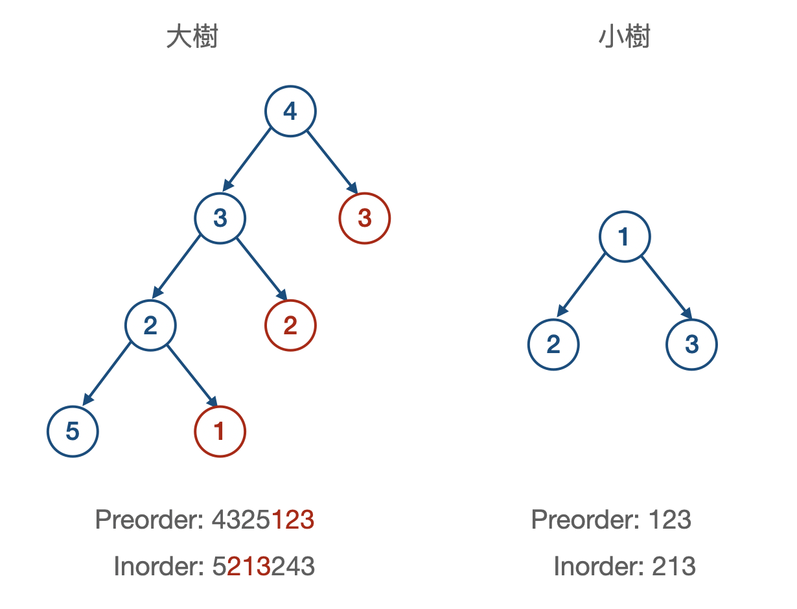
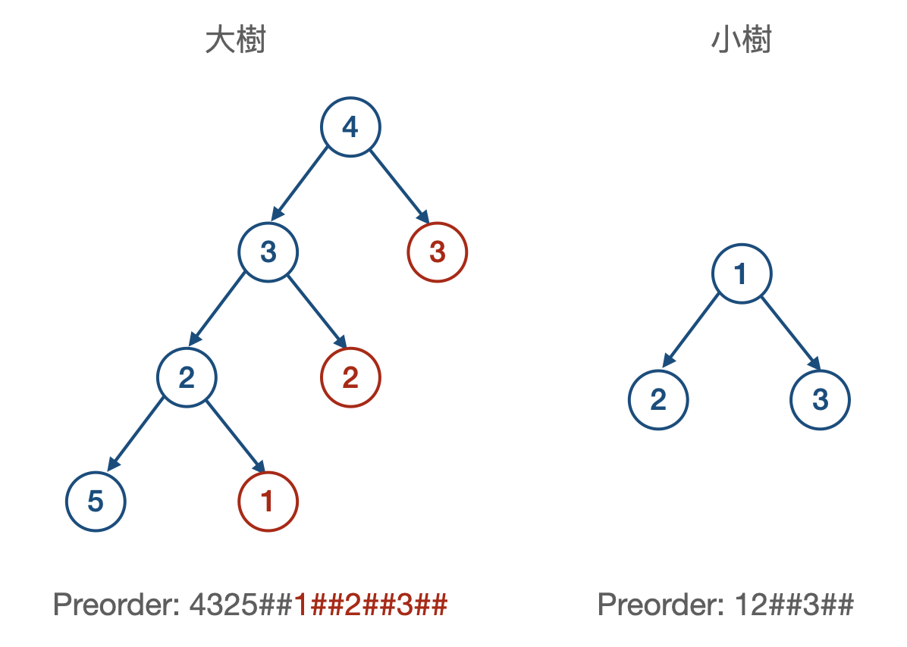
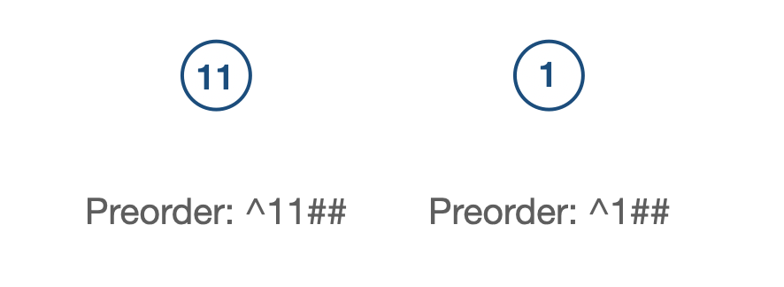

# Subtree of Another Tree

[題目連結](https://leetcode.com/problems/subtree-of-another-tree/)

## 題目描述
原文：

Given the roots of two binary trees `root` and `subRoot`, return `true` if there is a subtree of `root` with the same structure and node values of `subRoot` and `false` otherwise.

A subtree of a binary tree `tree` is a tree that consists of a node in `tree` and all of this node's descendants. The tree `tree` could also be considered as a subtree of itself.

----

GPT 4 翻譯：

給定兩個二元樹的根節點 `root` 和 `subRoot`，如果 `root` 有一個子樹的結構和節點值與 `subRoot` 相同，則返回 `true`，否則返回 `false。`

二元樹 `tree` 的一個子樹是由 `tree` 中的一個節點及其所有後代節點組成的樹。樹 `tree` 也可以被視為其自身的一個子樹。

----

Example 1


```
Input: root = [3,4,5,1,2], subRoot = [4,1,2]
Output: true
```

Example 2


```
Input: root = [3,4,5,1,2,null,null,null,null,0], subRoot = [4,1,2]
Output: false
```

Constraints:

* The number of nodes in the `root` tree is in the range `[1, 2000]`.
* The number of nodes in the `subRoot` tree is in the range `[1, 1000]`.
* `-10^4 <= root.val <= 10^4`
* `-10^4 <= subRoot.val <= 10^4`


## 思路 1: DFS

要判斷大樹當中是不是包含子樹，可以做的方法是先在大樹的節點上做 DFS，也就是說：  
1. 如果發現`大樹的 root` = `小樹的 root`，那麼就遞迴得去找其左右子樹是否也相等。
2. 直到比對完都一模一樣就返回 `true`，否則就返回 `false`。

以上的做法應該是可行的，因為在 [100. Same Tree](../100.%20Same%20Tree/) 我們練習過，手法很類似，而這題這樣做的時間複雜度為 `O(NM)`，`N` 為大樹的節點數、 `M` 為小樹的節點數。


**方法 1: DFS**

* 步驟
    1. 建立一個和 [100. Same Tree](../100.%20Same%20Tree/) 一樣的函式。
    2. 粒用一個遞迴去判斷：
       1. `isSameTree(大樹的節點, 小樹的 root)` 相等就返回 `True`
       2. 其他狀況則繼續遞迴得去找 `dfs(大樹的左子樹, 小樹的 root)`、`dfs(大樹的右子樹, 小樹的 root)`
        
* 複雜度
    * 時間複雜度: O(NM)
    * 空間複雜度: O(N + M) # 遞迴的深度
    * `N` 為大樹的節點數、 `M` 為小樹的節點數。


## 思路 2:

看到類似 N 平方的時間複雜度，通常都有機會再優化，以這題來說，到底如何再更優化呢？這時候可以這樣思考：    
1. 如果要再更優化，代表我們希望掃過一次大樹 O(N)、再掃過一次小樹 O(M) 就能做完。
2. 掃過一次代表什麼意思？A: 利用各種 Traversal 的方式，將樹遍歷過一遍。
3. 讓小樹遍歷完的結果在大樹遍歷完的結果之上做搜尋。
上面這樣的思考，背後有一個最大的假設：遍歷出來的結果能夠被搜尋，且每一次結果是唯一的。但我們已知 PreOrder、InOrder、PostOrder、Level Order 的遍歷結果都不能還原成唯一的樹，那麼就不可能可以透過搜尋的方式來找。難道真的不可行嗎？  

再仔細回憶一下，過往所學的所有可能性，突然想到，之前說一種遍歷不行，那用兩種遍歷總可以組回唯一的樹了吧？例如 PreOrder 的結果搜尋一遍、InOrder 的結果搜尋一遍，如果兩次都有搜到，就代表小樹存在於大樹之中。  
👉 上面這樣想有一個最大的假設，就是 `PreOrderMatch(大樹, 小樹) && InOrderMatch(大樹, 小樹)` 若是 `True` 就成立。
❌ 有一種狀況可能會失敗，當樹是下面的狀況時：



但仔細認真思考，他會失敗的原因是什麼？如果能解決這個問題，是不是有機會？A: 最主要會的原因在於，葉子節點和非葉子節點分不清楚導致的，以下圖為例，Preorder 產生的 `123` 是三個葉子節點在遍歷時產生的。



所以如果只要將所有 None 的地方，也都給他一個字符 `#`，或許可以解決這個問題，如下圖所示：  



最後來 Debug 一下，把以下這個狀況也排除掉，就是在節點前面加上字符 `^`


變成以下



## 方法 2: String Matching

* 步驟
    1. 利用 Preorder 將大樹做遍歷、小樹做遍歷並做微調。
    2. 將兩字串做 KMP（Knuth-Morris-Pratt） 演算法，搜尋大樹字串是否存在小樹字串。
    
* 複雜度
    * 時間複雜度: O(N + M)
    * 空間複雜度: O(N + M)
    * `N` 為大樹的節點數、 `M` 為小樹的節點數。
