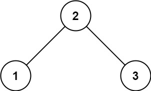

# Validate Binary Search Tree
[題目連結](https://leetcode.com/problems/validate-binary-search-tree/description/)

## 題目描述
原文：

Given the `root` of a binary tree, *determine if it is a valid binary search tree (BST).*

A **valid BST** is defined as follows:

* The left subtree of a node contains only nodes with keys **less than** the node's key.
* The right subtree of a node contains only nodes with keys **greater than** the node's key.
* Both the left and right subtrees must also be binary search trees.
 

----

GPT 4 翻譯：

給定一個二元樹的 `root`，*判斷它是否是一個有效的二元搜索樹（BST）。*

一個**有效的 BST** 定義如下：

* 節點的左子樹只包含鍵值**小於**該節點鍵值的節點。
* 節點的右子樹只包含鍵值**大於**該節點鍵值的節點。
* 左右子樹同時也必須是二元搜索樹。


----

Example 1



```
Input: root = [2,1,3]
Output: true
```

Example 2


```
Input: root = [5,1,4,null,null,3,6]
Output: false
Explanation: The root node's value is 5 but its right child's value is 4.
```


Constraints:

* The number of nodes in the tree is in the range `[1, 10^4]`.
* `-2^31 <= Node.val <= 2^31 - 1`
 

## 思路

題目做到現在，有沒有覺得每一題都很像？好像用遞迴就能解，以這題來看，會想到的遞迴式子可能長這樣：  
* Base Case: 如果遇到空節點則返回 None 
* Recursive Case: 其他狀況則繼續往左子節點、右子節點遞迴。
然後邏輯的部分為： `curr > left && curr < right` 表示該節點要比左子節點還大、比右子節點還小。 

如果你做到這裡，那你可能就落入了陷阱，回到題目「有效的 BST」，有效的 BST 可不是上述講的那樣，你看看以下的樹： 


他有一個隱藏的條件在於「該節點的左邊**所有**子節點都小於該節點、該節點的右邊**所有**子節點都大於該節點」。所有的意思，可不是上面的 Recursive Case，而是遞迴時需要把上層的數值往下層節點做傳遞，讓下層節點知道「上界」或「下界」在哪裡，如下圖所示。


**方法 1: Recursive**

* 步驟
    1. Base Case: 如果遇到空節點則回傳 None
    2. Recursive Case: 返回 `dfs(root.left, 最小值, root.val) && dfs(root.right, root.val, 最大值)`。

* 複雜度
    * 時間複雜度: O(N)
    * 空間複雜度: O(h)
    * 備註：h 為樹高，平均來說為 logN，最糟狀況為 N

**方法 2: Iterative**

* 步驟
    1. 初始化 stack。
    2. 先將 `(root, -math.inf, math.inf)` 放入 stack 中。
    3. 每一次從 stack 取出一個項目，包含(節點, 最小值, 最大值)，然後要判斷
       1. `節點 =< 最小值 or 節點 >= 最大值` 返回 `False`
       2. 其他狀況則在把左子節點、右子節點加入 stack 中，範圍需要注意。
          1. 左子節點狀況：`stack.append(root.left, 該層最小值, root.val)`
          2. 右子節點狀況：`stack.append(root.right, root.val, 該層最大值)`

* 複雜度
    * 時間複雜度: O(N)
    * 空間複雜度: O(h)
    * 備註：h 為樹高，平均來說為 logN，最糟狀況為 N
